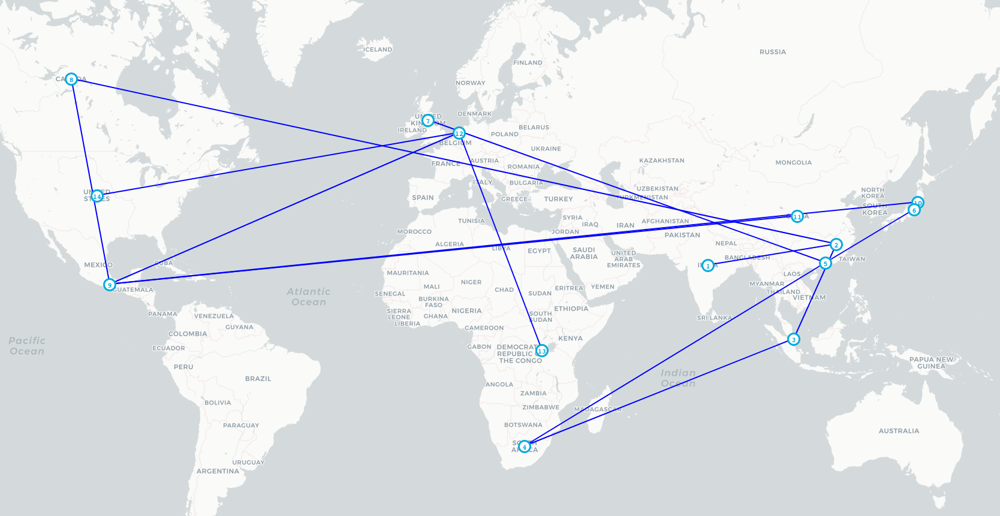

## Geolocalizer

### Purpose

This Python program lets you geographically locate evolutionary relationships present in a phylogenetic tree by combining it with coordinates obtained from the NCBI database to create an interactive map.

### Workflow

The program will receive a FASTA file containing the sequences to analyze, and a configuration file which lets you customize the alignment and tree building steps.

First of all, the file will go through our parser to ensure that we have a significant number of sequences of the same type and extract the necessary information from it. We'll discard non-matching sequences and display a warning on the console.

The second step is to gather all the geolocalization data. To do this, our `GeoServices` class will use the NCBI accession id obtained by the parser to query the Entrez database and add the coordinates to the sequences data.

After doing this, our `AlignAndTree` class will align the FASTA file using clustal and generate the phylogenetic tree with iqtree. The user can tweak the parameters sent to these programs in the conf file.

Finally, the `Canvas` class will traverse the tree and create the map, which reflects the tree structure by keeping the relations connected.

### Setup

Recreate the Conda environment from the environment.yml file provided inside this repo:

`conda env create -f environment.yml`

To enable the environment, run: 

`conda activate geolocalizer`

Don't forget to update the YML file if you added new dependencies or updated existing ones by running:

`conda env export > environment.yml`

To update dependencies, run:

`conda env update -n geolocalizer --file environment.yml  --prune`

### Basic usage

You'll need an NCBI account to communicate with the Entrez database. Please edit your `config.json` file and add your address to the email variable.

To call the program:

`python main.py --fasta src/files/examples_2.fasta`

### Config your environment

In the main folder there is a file_configuration.json where you can modify the parameters set by default. 

***IMPORTANT:*** there must be an email from a valid account at https://www.ncbi.nlm.nih.gov/gene/
We can also parameterize clustal and iqtree.
In Clustal the number of threads must be greater than 1.
In IQtree the Bootstrap value must be greater than or equal to 1000, and the finder model can be one of the following: 
+ -m TESTONLY          (Standard model selection / like jModelTest, ProtTest)
+ -m TEST              (Standard model selection followed by tree inference)
+ -m MF                (Extended model selection with FreeRate heterogeneity)
+ -m MFP               (Extended model selection followed by tree inference)
+ -m TESTMERGEONLY     (Find best partition scheme / like PartitionFinder)
+ -m TESTMERGE         (Find best partition scheme followed by tree inference)
+ -m MF+MERGE          (Find best partition scheme incl. FreeRate heterogeneity)
+ -m MFP+MERGE         (Like -m MF+MERGE followed by tree inference)  

***IMPORTANT:*** If a Model Finder is setup, the value of bootstrap is not considered since they are mutually exclusive.  

### Debugging

You'll find every file created by the program inside the `tmp` folder. There's also a log file you can use to understand more about the execution.

### Map example

